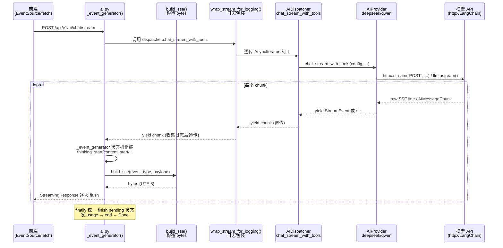
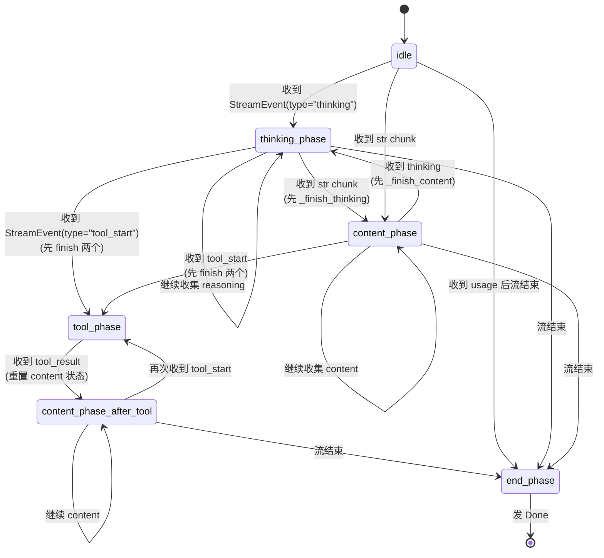

# AI 大模型 SSE 流式处理

> 本文档描述从 Provider 底层 yield 到前端 EventSource 消费的完整 SSE 链路实现。
> 所有代码路径、函数名、类型定义均与项目实际实现一致。

---

## 1. 整体链路

### 1.1 端到端数据流图



### 1.2 ASCII 链路一览

```
┌──────────────────────────────────────────────────────────────────────────────┐
│  Provider._stream_raw() / chat_stream_with_tools()                           │
│  yield StreamEvent(type="thinking", reasoning=...)   ← 结构化事件             │
│  yield StreamEvent(type="tool_start", ...)                                  │
│  yield StreamEvent(type="tool_result", ...)                                 │
│  yield StreamEvent(type="usage", ...)                                       │
│  yield "纯文本 content"                               ← 原始字符串           │
└────────────────────────────┬─────────────────────────────────────────────────┘
                             │ AsyncIterator[StreamChunk]  （StreamChunk = Union[str, StreamEvent]）
                             ▼
┌──────────────────────────────────────────────────────────────────────────────┐
│  AIDispatcher.chat_stream_with_tools()                                       │
│  async for chunk in wrap_stream_for_logging(provider.chat_stream_with_tools(),│
│                                             ai_logger):                     │
│      yield chunk        ← 透传，无加工                                       │
└────────────────────────────┬─────────────────────────────────────────────────┘
                             │ AsyncIterator[StreamChunk]
                             ▼
┌──────────────────────────────────────────────────────────────────────────────┐
│  wrap_stream_for_logging(chunk_iter, ai_logger)   app/services/ai_logger.py  │
│  - str chunk → logger.record_content(chunk)                                  │
│  - StreamEvent(type="thinking") → logger.record_thinking(reasoning)          │
│  - 所有 chunk 原样 yield（包装器，不拦截流）                                    │
│  - finally: logger.enqueue()  入队异步日志                                    │
└────────────────────────────┬─────────────────────────────────────────────────┘
                             │ AsyncIterator[StreamChunk]
                             ▼
┌──────────────────────────────────────────────────────────────────────────────┐
│  _event_generator()    app/api/v1/ai.py    （路由层内部状态机）                │
│  组装 start / thinking_start / thinking / thinking_end /                      │
│        content_start / content / content_end / tool_start /                  │
│        tool(兼容) / tool_result / usage / end / Done                         │
│  build_sse(event_type, payload) → bytes                                      │
└────────────────────────────┬─────────────────────────────────────────────────┘
                             │ AsyncIterator[bytes]
                             ▼
┌──────────────────────────────────────────────────────────────────────────────┐
│  StreamingResponse(                                                          │
│      _event_generator(),                                                     │
│      media_type="text/event-stream",                                         │
│      headers={                                                               │
│          "Cache-Control": "no-cache",                                        │
│          "Connection": "keep-alive",                                         │
│          "X-Accel-Buffering": "no",      ← 禁用 Nginx 缓冲                    │
│      },                                                                      │
│  )                                                                           │
└────────────────────────────┬─────────────────────────────────────────────────┘
                             │ HTTP Response Body (text/event-stream)
                             ▼
                    前端 EventSource / fetch + ReadableStream
```

---

## 2. EventType 枚举完整列表

定义位置：`app/services/ai/base.py:10-24`

```python
class EventType(str, Enum):
    START = "start"
    THINKING_START = "thinking_start"
    THINKING = "thinking"
    THINKING_END = "thinking_end"
    CONTENT_START = "content_start"
    CONTENT = "content"
    CONTENT_END = "content_end"
    TOOL_START = "tool_start"
    TOOL_RESULT = "tool_result"
    USAGE = "usage"
    END = "end"
    ERROR = "error"
    TOOL = "tool"
    DONE = "Done"
```

### 2.1 事件对照表

| EventType 值 | JSON 字段 (StreamEvent dataclass) | 含义 | 触发时机 |
|---|---|---|---|
| `start` | `request_id`, `model`, `model_name`, `thinking`, `enable_search`, `timestamp` | 请求开始，前端据此初始化 UI、展示模型信息 | 路由层 `_event_generator` 最先 yield |
| `thinking_start` | `timestamp` | 思考阶段开始（进入 reasoning_content 消费） | 收到第一个 `type="thinking"` 的 StreamEvent |
| `thinking` | `reasoning` (增量文本) | 思考内容增量流（模型的思维链） | Provider `_stream_raw` 从 `delta.reasoning_content` 实时抽取 |
| `thinking_end` | `reasoning` (完整文本), `total_chars` | 思考阶段结束，输出完整思考内容及字数 | 收到 content chunk / tool chunk 时触发 `_finish_thinking()`，或 finally |
| `content_start` | `timestamp` | 正式回答阶段开始 | 收到第一个 str 类型 chunk（纯文本） |
| `content` | `content` (增量文本) | 回答内容增量流 | Provider yield 原始字符串 |
| `content_end` | `content` (完整文本), `total_chars` | 回答阶段结束，输出完整回答及字数 | 流结束、切换到 thinking/tool、或 finally |
| `tool_start` | `tool_call_id`, `name`, `args` | 工具调用开始（记录工具名与参数） | Provider `chat_stream_with_tools` 内检测到 `tool_calls` |
| `tool_result` | `tool_call_id`, `name`, `result`, `elapsed_ms` | 工具调用结果 | Provider 执行完 `do_search(query)` 后 |
| `usage` | `prompt_tokens`, `completion_tokens`, `total_tokens`, `reasoning_tokens` | Token 用量统计 | Provider `_stream_raw` 从 `last_raw_chunk.usage` 提取，流末尾 yield；`_event_generator` 缓冲后在 end 前统一发出 |
| `end` | `request_id`, `stop_reason` (`stop`/`error`), `elapsed_ms` | 请求结束（含总耗时） | 流正常完成或捕获异常时 |
| `error` | `message`, `code` | 运行时错误 | 捕获到 BusinessException 或通用 Exception |
| `tool` | `name`, `args` | 向后兼容别名（老版本前端使用） | `_event_generator` 处理 `tool_start` 时额外发出一份 |
| `Done` | *(空对象)* | 流终止哨兵，前端收到即关闭连接 | 所有分支的 finally 中统一 yield |

### 2.2 StreamEvent dataclass 字段说明

定义位置：`app/services/ai/base.py:27-67`

所有字段均为 `Optional`，仅在对应 `type` 下使用。设计为通用事件容器，避免为每种事件创建独立 dataclass。

---

## 3. StreamChunk 类型

定义位置：`app/services/ai/base.py:80`

```python
StreamChunk = Union[str, StreamEvent]
```

这是整个流式链路中最核心的传输单位——只有两种可能形态：

| 形态 | 来源 | 消费方式 |
|---|---|---|
| `str` | Provider 从模型 SSE 的 `delta.content` 直接抽取，原样 yield | 路由层识别为 **content 增量** |
| `StreamEvent` | Provider 构造的结构化事件（thinking / tool_start / tool_result / usage） | 路由层根据 `chunk.type` 分支处理 |

**设计理由**：LangChain 的 `AIMessageChunk.content` 天然是字符串，而 `reasoning_content`、工具调用元信息需要结构化携带。用 Union 让 Provider 层的 yield 语句保持直观，不需要把所有 chunk 都包装成 dataclass。

---

## 4. `_event_generator` 状态机

定义位置：`app/api/v1/ai.py:113-271`（`chat_stream` 路由内部的 async generator）

### 4.1 局部状态变量

```python
thinking_parts: list[str] = []
content_parts: list[str] = []
thinking_started = False
content_started = False
thinking_ended = False
content_ended = False
usage_data = {
    "prompt_tokens": None,
    "completion_tokens": None,
    "total_tokens": None,
    "reasoning_tokens": None,
}
```

### 4.2 辅助闭包

```python
def _finish_thinking():
    nonlocal thinking_started, thinking_ended
    if thinking_started and not thinking_ended:
        full = "".join(thinking_parts)
        thinking_ended = True
        yield build_sse("thinking_end", {
            "reasoning": full, "total_chars": len(full),
        })

def _finish_content():
    nonlocal content_started, content_ended
    if content_started and not content_ended:
        full = "".join(content_parts)
        content_ended = True
        yield build_sse("content_end", {
            "content": full, "total_chars": len(full),
        })
```

### 4.3 状态转换规则



### 4.4 关键转换代码片段

**收到 thinking chunk → 先 finish_content：**

```python
# ai.py:173-183
if chunk.type == "thinking":
    for _x in _finish_content():   # 先关闭 content 段
        yield _x
    if not thinking_started:
        thinking_started = True
        yield build_sse("thinking_start", {...})
    thinking_parts.append(text)
    yield build_sse("thinking", {"reasoning": text})
```

**收到 str chunk → 先 finish_thinking：**

```python
# ai.py:219-228
else:   # chunk 是 str
    for _x in _finish_thinking():  # 先关闭 thinking 段
        yield _x
    if not content_started:
        content_started = True
        yield build_sse("content_start", {...})
    content_parts.append(chunk)
    yield build_sse("content", {"content": chunk})
```

**收到 tool_result → content 状态重置：**

```python
# ai.py:200-209
elif chunk.type == "tool_result":
    yield build_sse("tool_result", {...})
    content_started = False      # ← 关键！模型拿到工具结果后重新生成回答
    content_ended = False
    content_parts.clear()
```

### 4.5 三个分支的 finally/尾部收尾逻辑

**try 正常路径尾部（ai.py:230-243）：**

```python
for _x in _finish_content():   # 关 content
    yield _x
for _x in _finish_thinking():  # 关 thinking
    yield _x

yield build_sse("usage", usage_data)   # 统一发 usage

yield build_sse("end", {
    "stop_reason": "stop",
    "request_id": request_id,
    "elapsed_ms": elapsed_ms,
})
yield build_sse("Done", {})
```

**BusinessException 分支（ai.py:245-257）：**

```python
except BusinessException as e:
    for _x in _finish_content(): yield _x
    for _x in _finish_thinking(): yield _x
    yield build_sse("error", {"message": e.message, "code": e.code})
    yield build_sse("end", {"stop_reason": "error", ...})
    yield build_sse("Done", {})
```

**通用 Exception 分支（ai.py:258-271）：**

```python
except Exception as e:
    for _x in _finish_content(): yield _x
    for _x in _finish_thinking(): yield _x
    yield build_sse("error", {"message": f"[错误: {str(e)}]"})
    yield build_sse("end", {"stop_reason": "error", ...})
    yield build_sse("Done", {})
```

**所有三条路径都保证：**
- `_finish_content` / `_finish_thinking` 被调用（幂等，不会重复发 end）
- `Done` 一定作为最后一条事件发出——这是前端识别"流结束"的唯一可靠信号

---

## 5. 标准事件序列

### 5.1 正常流式对话（无 thinking、无 tool）

```
start
content_start
content  (chunk 1)
content  (chunk 2)
content  (chunk 3)
...
content_end
usage
end      stop_reason="stop"
Done
```

### 5.2 带 thinking 的对话

```
start
thinking_start
thinking   (reasoning chunk 1)
thinking   (reasoning chunk 2)
...
thinking_end
content_start
content    (chunk 1)
content    (chunk 2)
...
content_end
usage
end        stop_reason="stop"
Done
```

### 5.3 带工具调用的对话（enable_search=True）

```
start
[thinking_start → thinking* → thinking_end]    ← 可选，若开启 thinking

content_start                                  ← 模型第一次生成的前缀文本
content*

tool_start   {tool_call_id, name: "web_search", args: {query}}
tool         {name, args}                      ← 向后兼容别名
tool_result  {tool_call_id, name, result, elapsed_ms}

content_start                                  ← ↑ tool_result 重置后重新开始
content*

[第二次工具调用循环，最多 3 次]

content_end
usage
end        stop_reason="stop"
Done
```

### 5.4 错误序列

```
start
[可能 thinking/content 若干]
error      {message, code?}
end        stop_reason="error"
Done
```

---

## 6. SSE 格式细节

### 6.1 `build_sse` 函数

定义位置：`app/services/ai/sse.py:4-23`

```python
def build_sse(event: str, data) -> bytes:
    if data is None:
        data = {}
    payload = json.dumps(data, ensure_ascii=False)
    lines = [f"event: {event}", f"data: {payload}"]
    return ("\n".join(lines) + "\n\n").encode("utf-8")
```

### 6.2 输出格式（示例）

```
event: content
data: {"content": "你好"}

event: thinking
data: {"reasoning": "让我想想"}

event: tool_start
data: {"tool_call_id": "call_abc", "name": "web_search", "args": {"query": "北京天气"}}

event: Done
data: {}

```

每个事件由 `\n\n`（两个换行）作为结束分隔，这是 HTML5 Server-Sent Events 规范的硬性要求。

### 6.3 为什么手动构造 bytes 而不用 `EventSourceResponse`

项目早期使用过 `sse-starlette` 的 `EventSourceResponse`，但在以下场景触发 **BrokenResourceError**：

1. 前端主动断开连接（关闭 EventSource）
2. `EventSourceResponse` 内部的 keepalive task 仍向已关闭的 ASGI channel 发 `ping` 帧
3. httpx 客户端收到异常后关闭了底层 TCP 连接，但 generator 还在 `yield`

**现在的做法**：`StreamingResponse` 直接消费 generator 产出的 bytes，FastAPI 的 ASGI 层在 generator 抛出异常/返回时会正确清理 channel，不会有多余的后台 task 干扰。

---

## 7. StreamingResponse 构造

定义位置：`app/api/v1/ai.py:273-281`

```python
return StreamingResponse(
    _event_generator(),
    media_type="text/event-stream",
    headers={
        "Cache-Control": "no-cache",
        "Connection": "keep-alive",
        "X-Accel-Buffering": "no",
    },
)
```

### 7.1 三个关键 Header 的作用

| Header | 值 | 作用 |
|---|---|---|
| `Cache-Control` | `no-cache` | 禁止浏览器和任何中间代理缓存 SSE 响应，确保事件实时送达 |
| `Connection` | `keep-alive` | 保持长连接，避免 HTTP/1.1 代理过早关闭 |
| `X-Accel-Buffering` | `no` | **禁用 Nginx 缓冲**。默认情况下 Nginx 会把整个响应体攒到一定大小再发出，会导致 SSE 事件被延迟成批送达。`X-Accel-Buffering: no` 告诉 Nginx 逐 chunk flush |

> 同样的问题在 Cloudflare Workers、某些 CDN 上也存在，它们有各自的禁用缓冲 header（如 `cf-cache-status: DYNAMIC`）。

---

## 8. Provider 底层的流式实现

### 8.1 两条路径：LangChain vs 原生 httpx

每个 Provider（DeepSeek / Qwen）都有两条流式通道：

| 路径 | 触发条件 | 代码位置 | 原因 |
|---|---|---|---|
| LangChain `llm.astream()` | `thinking=False` 且无工具 / 或工具循环内 | `chat_stream` / `chat_stream_with_tools` | 简洁，LangChain 已处理 tool_calls 解析 |
| 原生 httpx `_stream_raw()` | `thinking=True` | `_stream_raw` | **LangChain 会丢弃 `reasoning_content` 字段**（设计决策），必须直接读模型 SSE 才能拿到思考内容 |

### 8.2 `_HTTPX_STREAM_TIMEOUT` 配置

定义位置：
- `app/services/ai/deepseek_provider.py:24-29`
- `app/services/ai/qwen_provider.py:24-29`

完全一致：

```python
_HTTPX_STREAM_TIMEOUT = httpx.Timeout(
    connect=30.0,
    read=None,          # streaming 模式下不做 chunk 间隔超时
    write=30.0,
    pool=30.0,
)
```

**`read=None` 的含义**：取消"两次 chunk 之间必须在 N 秒内到达"的约束。模型进入 thinking 阶段后，reasoning → content 切换期间可能 30 秒以上无任何数据，默认 30s read timeout 会把连接掐掉。

### 8.3 `_stream_raw` 核心逻辑

```python
async def _stream_raw(self, config, messages, thinking=False) -> AsyncIterator[StreamChunk]:
    # ... 组装 url / headers / payload ...
    last_raw_chunk = None
    done_seen = False
    chunk_count = 0
    try:
        async with httpx.AsyncClient(timeout=_HTTPX_STREAM_TIMEOUT) as client:
            async with client.stream("POST", url, json=payload, headers=headers) as response:
                response.raise_for_status()
                async for line in response.aiter_lines():
                    if not line or not line.startswith("data:"):
                        continue
                    data_str = line[len("data:"):].strip()
                    if data_str == "[DONE]":
                        done_seen = True
                        break
                    chunk = json.loads(data_str)
                    delta = chunk["choices"][0]["delta"]
                    reasoning = delta.get("reasoning_content")
                    if reasoning:
                        yield StreamEvent(type="thinking", reasoning=reasoning)
                    content = delta.get("content")
                    if content is not None:
                        yield content           # ← str，不是 StreamEvent
    # ... 异常处理 ...
    # ... finally 未收到 [DONE] 打 warning ...

    # 流结束后从最后一个 chunk 提取 usage
    if last_raw_chunk:
        usage = last_raw_chunk.get("usage", {}) or {}
        if usage:
            yield StreamEvent(type="usage",
                prompt_tokens=usage.get("prompt_tokens"),
                completion_tokens=usage.get("completion_tokens"),
                total_tokens=usage.get("total_tokens"),
            )
```

### 8.4 工具调用循环（最多 3 次）

定义位置：
- `app/services/ai/deepseek_provider.py:290-361`
- `app/services/ai/qwen_provider.py:266-336`

```python
for _ in range(3):
    accumulated = await llm_with_tools.ainvoke(lc_messages)
    tool_calls = accumulated.tool_calls

    if not tool_calls:
        # 无工具调用 → 模型已输出最终回答，走流式 astream 返回
        async for chunk in llm_with_tools.astream(lc_messages):
            yield ...
        return

    # 有工具调用 → 先 yield 前置内容 / thinking
    if accumulated.content:
        yield accumulated.content

    # 对每个 tool_call：
    #   yield StreamEvent(type="tool_start", ...)
    #   执行 do_search(query)
    #   yield StreamEvent(type="tool_result", ...)
    #   lc_messages.append(ToolMessage(...))

# 循环耗尽 → 强制让模型输出最终回答
logger.warning("工具调用循环耗尽，强制让模型输出最终回答")
async for chunk in llm_with_tools.astream(lc_messages):
    yield ...
```

---

## 9. `wrap_stream_for_logging` 日志包装

定义位置：`app/services/ai_logger.py:87-105`

```python
async def wrap_stream_for_logging(
    chunk_iter: AsyncIterator,
    logger: AIChatLogger,
) -> AsyncIterator:
    try:
        async for chunk in chunk_iter:
            if isinstance(chunk, str):
                logger.record_content(chunk)
            elif isinstance(chunk, StreamEvent):
                if chunk.type == "thinking":
                    logger.record_thinking(chunk.reasoning or chunk.result or "")
            yield chunk                       # 原样透传
    except Exception as exc:
        logger.record_error(f"{type(exc).__name__}: {str(exc)}")
        raise
    finally:
        logger.enqueue()                     # 幂等，不会重复入队
```

**职责**：
- 对上游 chunk **零拦截**，只做旁路收集
- `AIChatLogger` 内部维护 `_collected`（content 片段）和 `_thinking_parts`（thinking 片段），`enqueue()` 时合成为完整字符串入队 `log_queue`
- 异常发生时先 `record_error` 再 `raise`，确保错误也被记录

---

## 10. 遇到的问题与解决方案

### 问题 1：LangChain 清除 reasoning_content

**症状**：开启 thinking 模式后，流式回复中始终没有思考内容，但 `ai_logger` 里能看到完整回答——说明 thinking 数据根本没传到路由层。

**根因**：LangChain 的 `ChatOpenAI.astream()` 内部会做一次 message 清洗，其中 `reasoning_content` 字段被显式忽略（LangChain 认为它不是标准 OpenAI 协议字段），导致 `AIMessageChunk.additional_kwargs` 中该字段为空。

**解决**：Provider 层新增 `_stream_raw` 方法，用原生 `httpx.AsyncClient.stream()` 直接消费模型 SSE。绕过 LangChain 中间层，从 `data:` 行的 JSON 里手动提取 `delta.reasoning_content`。

**代码位置**：
- `deepseek_provider.py:127-205` `_stream_raw`
- `qwen_provider.py:119-194` `_stream_raw`

---

### 问题 2：EventSourceResponse BrokenResourceError

**症状**：前端频繁刷新或在流中途关闭 EventSource 时，后端日志出现大量 `BrokenResourceError: Cannot send data to closed stream`。

**根因**：`sse-starlette` 的 `EventSourceResponse` 在后台起了一个 keepalive task，定时向 ASGI channel 发送心跳。当前端断开后，generator 里的 `yield` 抛出异常退出，但 keepalive task 还在跑，继续向已关闭的 channel 写数据。

**解决**：放弃 `EventSourceResponse`，改用 FastAPI 原生 `StreamingResponse` + 手动构造的 bytes generator。`StreamingResponse` 没有额外的后台 task，generator 退出即整条链清理干净。

**代码位置**：`sse.py:build_sse` + `ai.py:273-281` `StreamingResponse(...)`

---

### 问题 3：httpx read timeout 掐断思考流

**症状**：带 thinking 的对话经常在思考中途（约 30s）断开，日志里有 `ReadTimeout`，前端收到不完整的思考内容或直接报错。

**根因**：httpx 默认 read timeout = 30s，意思是"两次数据到达之间不能超过 30s"。模型从 reasoning 切换到正式 content 可能间隔更长，特别是复杂推理任务。

**解决**：在两个 Provider 顶层定义 `_HTTPX_STREAM_TIMEOUT = httpx.Timeout(read=None, connect=30, write=30, pool=30)`，`read=None` 禁用读取间隔超时。

**代码位置**：
- `deepseek_provider.py:24-29`
- `qwen_provider.py:24-29`

---

### 问题 4：工具调用循环耗尽后无输出

**症状**：`enable_search=True` 时，模型如果连续 3 次都选择调用工具而不回复，3 次循环耗尽后流直接结束，前端只收到工具结果没有最终回答。

**根因**：工具循环的退出条件是"模型这次没有 tool_calls"——也就是模型自己决定停止调用工具。如果模型始终选择调工具，循环耗尽就直接结束了，没有强制让模型输出最终内容。

**解决**：在 `for _ in range(3):` 循环之后增加兜底分支：强制调用 `llm_with_tools.astream(lc_messages)` 让模型输出最终回答。并打 warning 日志以便监控。

**代码位置**：
- `deepseek_provider.py:349-361`
- `qwen_provider.py:325-336`

```python
# 循环耗尽兜底
logger.warning("工具调用循环耗尽，强制让模型输出最终回答")
async for chunk in llm_with_tools.astream(lc_messages):
    # 正常 yield 逻辑
```

---

### 问题 5：SSE 流截断导致 Done 事件缺失

**症状**：在某些反代（Nginx + FRP）下，偶发前端只收到部分事件就断开，缺失 Done 导致前端 UI 永远停在"加载中"。

**根因**：最初的 generator 只在 try 块正常结束时发 Done，异常分支漏了；且 `_finish_content` / `_finish_thinking` 在异常时未被调用，导致 content_end / thinking_end 也缺失。

**解决**：重构为三条对称路径（try 尾部 / BusinessException / 通用 Exception），每条路径都先调两个 `_finish_*` 闭包，再发 end 和 Done。同时保证 `Done` 是最后一条事件——不依赖 `finally`（因为 generator 的 finally 只能做清理，不能再 yield）。

**代码位置**：`ai.py:230-271`

---

## 11. 前端消费示例

### 11.1 EventSource API（仅支持 GET）

```javascript
const es = new EventSource("/api/v1/ai/chat/stream?model=deepseek-v3&prompt=你好&thinking=true");

es.addEventListener("start", (e) => {
  const data = JSON.parse(e.data);
  console.log("request_id:", data.request_id, "model:", data.model_name);
});

es.addEventListener("thinking_start", () => {
  ui.openThinkingPanel();
});

es.addEventListener("thinking", (e) => {
  const { reasoning } = JSON.parse(e.data);
  ui.appendThinking(reasoning);
});

es.addEventListener("thinking_end", (e) => {
  const { reasoning, total_chars } = JSON.parse(e.data);
  ui.closeThinkingPanel(reasoning, total_chars);
});

es.addEventListener("content_start", () => {
  ui.openContentPanel();
});

es.addEventListener("content", (e) => {
  const { content } = JSON.parse(e.data);
  ui.appendContent(content);
});

es.addEventListener("tool_start", (e) => {
  const { name, args } = JSON.parse(e.data);
  ui.showToolCall(name, args);
});

es.addEventListener("tool_result", (e) => {
  const { name, result, elapsed_ms } = JSON.parse(e.data);
  ui.showToolResult(name, result, elapsed_ms);
});

es.addEventListener("usage", (e) => {
  const tokens = JSON.parse(e.data);
  console.log("token usage:", tokens);
});

es.addEventListener("end", (e) => {
  const { stop_reason, elapsed_ms } = JSON.parse(e.data);
  console.log("stream ended, reason:", stop_reason, "took:", elapsed_ms, "ms");
});

es.addEventListener("error", (e) => {
  const err = JSON.parse(e.data);
  ui.showError(err.message);
});

es.addEventListener("Done", () => {
  es.close();
  ui.finish();
});
```

### 11.2 fetch + ReadableStream（推荐，支持 POST）

路由签名是 `POST /api/v1/ai/chat/stream`（Form 参数），EventSource 只能 GET，因此**生产环境推荐 fetch 方案**：

```javascript
async function streamChat({ model, prompt, thinking, enable_search }) {
  const resp = await fetch("/api/v1/ai/chat/stream", {
    method: "POST",
    headers: { "Content-Type": "application/x-www-form-urlencoded" },
    body: new URLSearchParams({
      model,
      prompt,
      thinking: String(thinking),
      enable_search: String(enable_search),
    }),
  });

  if (!resp.ok) throw new Error(`HTTP ${resp.status}`);

  const reader = resp.body.getReader();
  const decoder = new TextDecoder();
  let buffer = "";

  while (true) {
    const { done, value } = await reader.read();
    if (done) break;

    buffer += decoder.decode(value, { stream: true });

    // SSE 事件以 \n\n 分割
    let idx;
    while ((idx = buffer.indexOf("\n\n")) !== -1) {
      const raw = buffer.slice(0, idx);
      buffer = buffer.slice(idx + 2);
      handleSSEEvent(raw);
    }
  }
}

function handleSSEEvent(raw) {
  const lines = raw.split("\n");
  let eventType = "message";   // 默认事件类型
  let jsonData = "{}";

  for (const line of lines) {
    if (line.startsWith("event:")) {
      eventType = line.slice(6).trim();
    } else if (line.startsWith("data:")) {
      jsonData = line.slice(5).trim();
    }
  }

  const data = JSON.parse(jsonData);

  switch (eventType) {
    case "thinking_start":
      ui.openThinkingPanel(); break;
    case "thinking":
      ui.appendThinking(data.reasoning); break;
    case "thinking_end":
      ui.closeThinkingPanel(data.reasoning); break;
    case "content_start":
      ui.openContentPanel(); break;
    case "content":
      ui.appendContent(data.content); break;
    case "tool_start":
      ui.showToolCall(data.name, data.args); break;
    case "tool_result":
      ui.showToolResult(data.name, data.result, data.elapsed_ms); break;
    case "usage":
      console.log("tokens:", data); break;
    case "end":
      console.log("elapsed:", data.elapsed_ms, "ms, stop:", data.stop_reason); break;
    case "error":
      ui.showError(data.message); break;
    case "Done":
      ui.finish(); return;
    default:
      console.log("unhandled event:", eventType, data);
  }
}
```

### 11.3 文件上传场景（multipart/form-data）

```javascript
const fd = new FormData();
fd.append("model", "deepseek-v3");
fd.append("prompt", "基于文件总结一下");
fd.append("thinking", "true");
files.forEach(f => fd.append("files", f));

const resp = await fetch("/api/v1/ai/chat/stream", {
  method: "POST",
  body: fd,
});
// 后续 ReadableStream 处理同上
```

---

## 12. 代码索引

| 层 | 文件 | 关键符号 |
|---|---|---|
| 类型定义 | `app/services/ai/base.py:10-80` | `EventType`, `StreamEvent`, `StreamChunk = Union[str, StreamEvent]` |
| SSE 构造 | `app/services/ai/sse.py:4-23` | `build_sse(event, data) -> bytes` |
| 调度器 | `app/services/ai/dispatcher.py:95-133` | `AIDispatcher.chat_stream_with_tools`（透传 AsyncIterator） |
| 日志包装 | `app/services/ai_logger.py:87-105` | `wrap_stream_for_logging` |
| 日志收集器 | `app/services/ai_logger.py:12-81` | `AIChatLogger` |
| 路由状态机 | `app/api/v1/ai.py:113-271` | `_event_generator()`（`chat_stream` 内部） |
| 路由 StreamingResponse | `app/api/v1/ai.py:273-281` | `StreamingResponse(...)` |
| Provider（DeepSeek） | `app/services/ai/deepseek_provider.py` | `_HTTPX_STREAM_TIMEOUT:24-29`, `_stream_raw:127-205`, `chat_stream_with_tools:250-361` |
| Provider（Qwen） | `app/services/ai/qwen_provider.py` | `_HTTPX_STREAM_TIMEOUT:24-29`, `_stream_raw:119-194`, `chat_stream_with_tools:236-336` |
