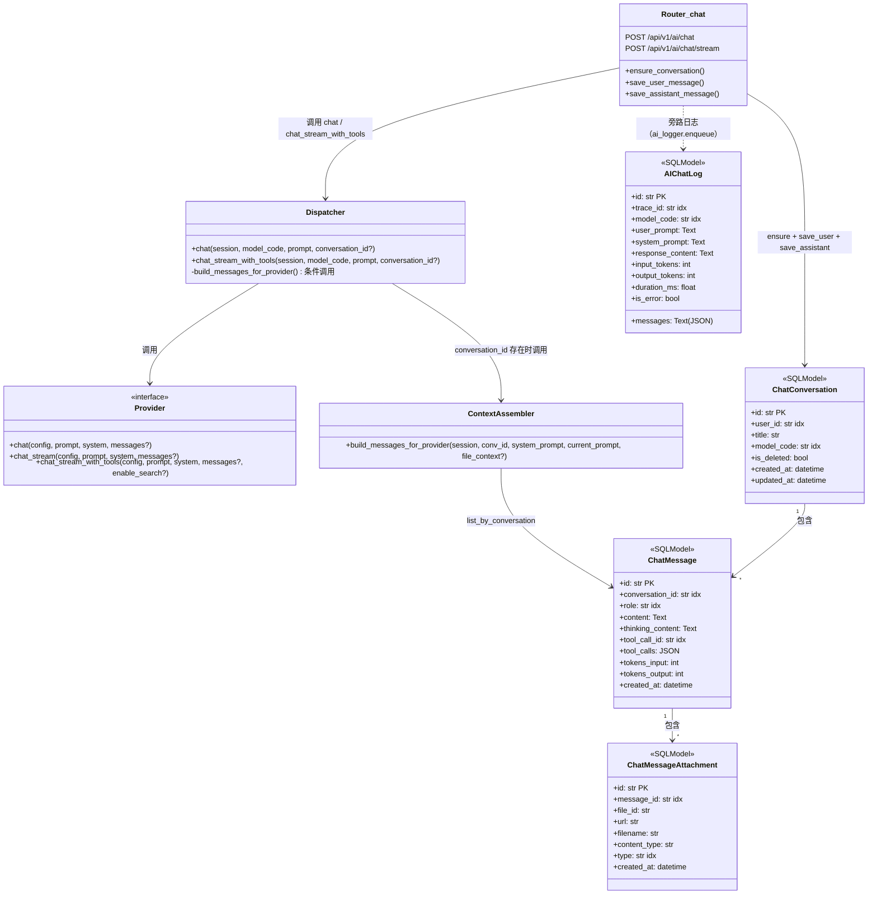

# 03 - 会话历史记录 (Chat History)

> 本文档描述会话历史记录模块的完整设计与实现，覆盖从数据表结构、Provider 接口升级、Dispatcher 集成、Context Assembler 到 SSE 流持久化的全链路。
> 所有代码路径、函数名、行号均与项目实际实现一致。

---

## 1. 设计概述

### 1.1 要解决的问题

在引入会话历史之前，每一次 AI 对话都是**无状态的单轮调用**——前端传入 `prompt` → 后端拼 `system_prompt` → 调 Provider → 返回结果。模型看不到之前聊过什么，无法完成"我刚才说什么了？""帮我接着刚才那个话题展开"这类多轮交互。

此外，以下场景也缺乏支撑：

| 需求 | 无会话记录时的状态 |
|---|---|
| 前端对话列表展示 | ❌ 无法列出历史会话 |
| 多轮上下文注入 | ❌ 每次都是单轮，模型无记忆 |
| 会话标题自动生成 | ❌ 无数据来源 |
| 会话软删除 / 重命名 | ❌ 无会话实体 |
| 消息级 token 统计 | ❌ token 只在 `ai_chat_log` 里，无结构化 |
| Tool Calling 历史追溯 | ❌ tool_calls JSON 无处落库 |
| Agent / RAG 扩展 | ❌ 无中间消息承载介质 |

### 1.2 核心设计决策

**决策一：分离 conversation + message 两张表**

会话表 `chat_conversation` 作为"容器"，只存元信息（用户、模型、标题、删除标记、时间戳）；消息表 `chat_message` 作为"内容"，一条记录 = 一条 user / assistant / tool 消息。查询时先拿 conversation_id，再按 `created_at ASC` 拉消息。

好处：
- 会话列表查询只需扫 `chat_conversation`，不必 JOIN 消息表，分页极快
- 消息历史可独立扩展（attachment、tool_calls、thinking_content），不影响会话表
- 软删除只改 `is_deleted` 一个布尔值，消息保留便于审计

**决策二：先写 user，后写 assistant 的两阶段写入**

user 消息在流式开始前立即落库（`save_user_message`），assistant 消息在流正常结束后才落库（`save_assistant_message`）。如果流中途异常（timeout / error / 前端断开），只保留 user 消息，assistant 不写入。

好处：
- 防断流丢消息——即使模型超时，用户"刚才问过什么"依然可追溯
- 避免不完整回复污染历史——assistant 只在流完整结束后入库
- 前端可据此判断：某轮只有 user 没有 assistant → 说明那轮失败了

**决策三：Provider messages 参数可选注入，保持向后兼容**

Provider 基类 `AIProvider.chat/chat_stream/chat_stream_with_tools` 签名升级为 `messages: Optional[list[dict]] = None`。当 `messages` 不为 None 时直接使用（多轮场景），否则走原有的 `prompt + system → _build_messages` 单轮路径。不传 `conversation_id` 时，Provider 行为与升级前完全一致。

---

## 2. 架构图

### 2.1 系统整体架构（classDiagram）



### 2.2 多轮对话完整时序图

```mermaid
sequenceDiagram
    participant Frontend as 前端
    participant Router as ai.py<br/>chat_stream
    participant ConvService as chat_conversation_service
    participant Dispatcher as AIDispatcher
    participant Context as build_messages_for_provider
    participant Provider as AIProvider<br/>(deepseek/qwen)
    participant DB as PostgreSQL

    Note over Frontend, DB: === 第一轮：无 conversation_id ===

    Frontend->>Router: POST /chat/stream<br/>(conversation_id=null, prompt="你好")
    Router->>ConvService: ensure_conversation(conversation_id=None, ...)
    ConvService->>DB: INSERT chat_conversation<br/>(title="你好", model_code=...)
    DB-->>ConvService: conv_1
    ConvService-->>Router: conv_1

    Router->>ConvService: save_user_message(conv_1, "你好")
    ConvService->>DB: INSERT chat_message (role=user, content="你好")
    DB-->>ConvService: msg_1

    Router->>Dispatcher: chat_stream_with_tools(..., conversation_id=conv_1)
    Dispatcher->>Context: build_messages_for_provider(session, conv_1, ...)
    Context->>DB: SELECT * FROM chat_message WHERE conversation_id=conv_1 ORDER BY created_at ASC
    DB-->>Context: [msg_1(user:"你好")]
    Context-->>Dispatcher: [{"role":"system",...}, {"role":"user","你好"}]

    Dispatcher->>Provider: chat_stream_with_tools(config, prompt, system, messages=[...])
    Provider-->>Dispatcher: yield StreamEvent / str (SSE 流)
    Dispatcher-->>Router: AsyncIterator[StreamChunk]
    Router-->>Frontend: StreamingResponse (SSE)

    Router->>ConvService: save_assistant_message(conv_1, "你好！...", thinking_content, tokens)
    ConvService->>DB: INSERT chat_message (role=assistant, content="你好！...")
    DB-->>ConvService: msg_2

    Note over Frontend, DB: === 第二轮：携带 conversation_id ===

    Frontend->>Router: POST /chat/stream<br/>(conversation_id=conv_1, prompt="我刚才说什么了？")
    Router->>ConvService: ensure_conversation(conversation_id=conv_1)
    ConvService->>DB: SELECT * FROM chat_conversation WHERE id=conv_1
    DB-->>ConvService: conv_1
    ConvService-->>Router: conv_1 (已存在，直接返回)

    Router->>ConvService: save_user_message(conv_1, "我刚才说什么了？")
    ConvService->>DB: INSERT chat_message (role=user, content="我刚才说什么了？")
    DB-->>ConvService: msg_3

    Router->>Dispatcher: chat_stream_with_tools(..., conversation_id=conv_1)
    Dispatcher->>Context: build_messages_for_provider(session, conv_1, ...)
    Context->>DB: SELECT * FROM chat_message WHERE conversation_id=conv_1 ORDER BY created_at ASC
    DB-->>Context: [msg_1, msg_2, msg_3]
    Context-->>Dispatcher: [
        {"role":"system",...},
        {"role":"user","你好"},
        {"role":"assistant","你好！..."},
        {"role":"user","我刚才说什么了？"}
    ]

    Dispatcher->>Provider: chat_stream_with_tools(config, prompt, system, messages=[历史+当前])
    Provider-->>Dispatcher: yield SSE 流
    Dispatcher-->>Router: AsyncIterator
    Router-->>Frontend: StreamingResponse

    Router->>ConvService: save_assistant_message(conv_1, "你刚才说：你好...")
    ConvService->>DB: INSERT chat_message (role=assistant)
    DB-->>ConvService: msg_4
```

---

## 3. 数据表结构

### 3.1 chat_conversation（会话表）

定义位置：`app/models/chat_conversation.py:9-28`
首次迁移：`alembic/versions/62d7a388d9b9_add_chat_history_tables.py:25-36`

| 字段 | 类型 | 说明 | 索引 |
|---|---|---|---|
| id | VARCHAR(32) PK | UUID4 hex | 主键 |
| user_id | VARCHAR | 关联用户 ID（可选，支持匿名会话） | `ix_chat_conversation_user_id` |
| title | VARCHAR | 会话标题，首轮自动取 prompt 前 30 字符 | - |
| model_code | VARCHAR | 使用的模型编码（自动更新） | `ix_chat_conversation_model_code` |
| is_deleted | BOOLEAN | 软删除标记，默认 False | 参与复合索引 |
| created_at | TIMESTAMPTZ | 创建时间 | - |
| updated_at | TIMESTAMPTZ | 最后活跃时间（每次发消息刷新） | 参与复合索引 |

**复合索引**（二次迁移 `0fb09f0ae365:34-39`）：

```sql
ix_chat_conversation_user_id_is_deleted_updated_at
    ON chat_conversation(user_id, is_deleted, updated_at)
```

该索引覆盖会话列表分页查询的三个核心过滤条件：按 `user_id` 定位 → 排除 `is_deleted=True` → 按 `updated_at DESC` 排序。

### 3.2 chat_message（消息表）

定义位置：`app/models/chat_message.py:10-38`
首次迁移：`alembic/versions/62d7a388d9b9_add_chat_history_tables.py:37-49`
二次迁移：`alembic/versions/0fb09f0ae365_add_tool_calls_to_chat_message.py:22-39`

| 字段 | 类型 | 说明 | 索引 |
|---|---|---|---|
| id | VARCHAR(32) PK | UUID4 hex | 主键 |
| conversation_id | VARCHAR | 所属会话 | `ix_chat_message_conversation_id` + 复合索引 |
| role | VARCHAR | `user` / `assistant` / `tool` | `ix_chat_message_role` |
| content | TEXT | 消息正文（user prompt 或 assistant 回答） | - |
| thinking_content | TEXT | 思考链内容（仅 assistant，thinking 模式） | - |
| tool_call_id | VARCHAR | tool 消息关联的 tool_call ID | `ix_chat_message_tool_call_id` |
| tool_calls | JSON | assistant 消息携带的 tool_calls 数组 | - |
| tokens_input | INTEGER | 本轮输入 token 数（usage event） | - |
| tokens_output | INTEGER | 本轮输出 token 数（usage event） | - |
| created_at | TIMESTAMPTZ | 创建时间 | 参与复合索引 |

**role 字段取值**：

| role | content 含义 | 附加字段 |
|---|---|---|
| `user` | 用户输入的 prompt | - |
| `assistant` | 模型输出的最终回答 | `thinking_content`（可选）、`tool_calls`（可选）、`tokens_input/output` |
| `tool` | 工具返回结果 | `tool_call_id`（必须，关联 assistant 的 tool_calls） |

**复合索引**（二次迁移 `0fb09f0ae365:28-33`）：

```sql
ix_chat_message_conversation_id_created_at
    ON chat_message(conversation_id, created_at)
```

多轮上下文查询核心索引——按 conversation_id 定位后按 created_at 顺序遍历。

### 3.3 chat_message_attachment（附件表）

定义位置：`app/models/chat_message_attachment.py:8-24`
迁移文件：`alembic/versions/62d7a388d9b9_add_chat_history_tables.py:50-62`

| 字段 | 类型 | 说明 | 索引 |
|---|---|---|---|
| id | VARCHAR(32) PK | UUID4 hex | 主键 |
| message_id | VARCHAR | 关联的 chat_message.id | `ix_chat_message_attachment_message_id` |
| file_id | VARCHAR | 关联的文件记录 ID | - |
| url | VARCHAR | 附件访问 URL | - |
| filename | VARCHAR | 原始文件名 | - |
| content_type | VARCHAR | MIME 类型 | - |
| type | VARCHAR | 附件类型（`image` / `file` 等） | `ix_chat_message_attachment_type` |
| created_at | TIMESTAMPTZ | 创建时间 | - |

### 3.4 thinking_content 与 content 的分离存储策略

**为什么分离**：thinking 模式下模型输出的 `reasoning_content`（思考链）和 `content`（最终回答）是两个独立的语义通道，前端需要独立渲染（折叠/展开思考面板），且在多轮上下文组装时**绝不应该把思考链发给模型**（会污染模型上下文窗口、浪费 token）。

**存储策略**：
- `content` → TEXT，始终存储模型正式回答
- `thinking_content` → TEXT，仅在开启 thinking 模式时有值；流结束时从 thinking_parts 拼接
- Context Assembler 只取 `content`，`thinking_content` 完全排除在发给 LLM 的 messages 之外（见 `app/services/chat_context.py:41-54`）

---

## 4. Provider 接口升级

### 4.1 AIProvider 基类签名变更

定义位置：`app/services/ai/base.py:83-122`

三个抽象方法统一新增 `messages: Optional[list[dict]] = None` 参数：

```python
@abstractmethod
async def chat(self, config, prompt: str, system: Optional[str] = None,
               messages: Optional[list[dict]] = None, thinking: bool = False) -> str:
    ...

@abstractmethod
async def chat_stream(self, config, prompt: str, system: Optional[str] = None,
                      messages: Optional[list[dict]] = None, thinking: bool = False) -> AsyncIterator[StreamChunk]:
    ...

@abstractmethod
async def chat_stream_with_tools(self, config, prompt: str, system: Optional[str] = None,
                                 messages: Optional[list[dict]] = None, thinking: bool = False,
                                 enable_search: bool = False, file_context: Optional[str] = None) -> AsyncIterator[StreamChunk]:
    ...
```

### 4.2 messages 参数优先级

```
messages 不为 None ?
├── YES → 直接使用该消息列表（多轮 / 外部组装场景）
└── NO  → 走原有 _build_messages(prompt, system) 单轮路径
```

在各 Provider 实现类（deepseek_provider、qwen_provider、ollama_provider）中，内部逻辑遵循：

```python
# Provider 内部伪代码
if messages is not None:
    final_messages = messages          # 外部已组装好，直接用
else:
    final_messages = self._build_messages(prompt, system)  # 单轮回退
```

### 4.3 向后兼容保证

`messages=None` 时 Provider 行为与升级前完全一致——路由层不传 `conversation_id` → Dispatcher 不传 `messages_to_pass` → Provider 走 `_build_messages(prompt, system)` 单轮路径。现有 `GET /api/v1/ai/chat/stream?prompt=xxx&model=deepseek-v3` 等无会话调用零改动、零影响。

---

## 5. Dispatcher 集成

### 5.1 chat() 方法集成点

代码位置：`app/services/ai/dispatcher.py:104-154`

关键逻辑：

```python
# dispatcher.py:132-147
messages_to_pass = None
if conversation_id:
    from app.services.chat_context import build_messages_for_provider
    messages_to_pass = await build_messages_for_provider(
        session,
        conversation_id,
        system_prompt,
        prompt,
        file_context,
    )

result = await provider.chat(
    config, prompt, system_prompt,
    messages=messages_to_pass,    # None 时 provider 回退单轮
    thinking=thinking,
)
```

Context Assembler 调用时机：**system_prompt 构建完成后、Provider 调用前**。lazy import（`from app.services.chat_context import build_messages_for_provider` 放在条件分支内）避免 import 循环。

### 5.2 chat_stream_with_tools() 方法集成点

代码位置：`app/services/ai/dispatcher.py:156-218`

结构与 `chat()` 完全对称：

```python
# dispatcher.py:194-211
messages_to_pass = None
if conversation_id:
    from app.services.chat_context import build_messages_for_provider
    messages_to_pass = await build_messages_for_provider(
        session, conversation_id, system_prompt, prompt, file_context,
    )

chunk_iter = provider.chat_stream_with_tools(
    config, prompt, system_prompt,
    messages=messages_to_pass,
    thinking=thinking,
    enable_search=enable_search,
    file_context=file_context,
)
```

**注意**：`file_context` 在走多轮路径时已由 `build_messages_for_provider` 拼入当前 user prompt 末尾（见第 6 节），Provider 内部不应重复拼接。`_build_messages` 单轮路径才由 Provider 自己处理 `file_context`。

---

## 6. Context Assembler（核心）

### 6.1 build_messages_for_provider 完整流程

定义位置：`app/services/chat_context.py:9-62`

```python
async def build_messages_for_provider(
    session: AsyncSession,
    conversation_id: str,
    system_prompt: str,
    current_user_prompt: str,
    file_context: str | None = None,
) -> list[dict]:
```

**执行步骤**：

```
1. chat_message_repository.list_by_conversation(session, conversation_id)
   → 查全部历史消息（created_at ASC）

2. 初始化 messages = []
   if system_prompt: messages.append({"role":"system", "content": system_prompt})

3. 遍历历史消息，按 role 分支：
   ├── role == "tool"
   │   → {"role":"tool", "tool_call_id": msg.tool_call_id, "content": msg.content}
   │
   ├── role == "assistant"
   │   → entry = {"role":"assistant", "content": msg.content}
   │   → if msg.tool_calls: entry["tool_calls"] = msg.tool_calls
   │   → 追加 entry
   │
   └── role == "user"（及其他）
       → {"role": msg.role, "content": msg.content}

4. 处理 file_context：
   if file_context:
       final_prompt = f"【文件上下文】\n{file_context}\n\n【用户问题】\n{current_user_prompt}"
   else:
       final_prompt = current_user_prompt

5. messages.append({"role":"user", "content": final_prompt})  ← 当前轮用户消息
6. return messages
```

**返回结构示例**（第二轮对话）：

```python
[
    {"role": "system", "content": "你是 deepseek-v3...（identity + global_default + model_prompt + user_system）"},
    {"role": "user", "content": "你好"},
    {"role": "assistant", "content": "你好！有什么可以帮你？", "tool_calls": None},
    {"role": "user", "content": "我刚才说什么了？"}
]
```

### 6.2 thinking_content 排除策略

在 `chat_context.py:41-54` 的消息遍历循环中，无论什么 role，都只取 `msg.content`，**永不取 `msg.thinking_content`**。这是设计保证：

- 思考链不传给模型——模型不需要看到自己上一轮的思维过程
- 节省 token——reasoning 内容通常比正式回答长数倍
- 避免上下文污染——思考链可能包含模型的自我怀疑、中间推演等不稳定内容

### 6.3 tool 消息拼装

当历史中存在 `role="tool"` 的消息时，需要携带 `tool_call_id` 才能被模型正确关联到之前发出的 tool_call：

```python
# chat_context.py:42-47
if msg.role == "tool":
    messages.append({
        "role": "tool",
        "tool_call_id": msg.tool_call_id or "",
        "content": msg.content or "",
    })
```

assistant 消息若携带了 tool_calls JSON 数组（`chat_message.tool_calls` 字段），也会一并注入：

```python
# chat_context.py:48-52
elif msg.role == "assistant":
    entry: dict = {"role": "assistant", "content": msg.content or ""}
    if msg.tool_calls:
        entry["tool_calls"] = msg.tool_calls
    messages.append(entry)
```

这样模型就看到了完整的 tool_call → tool_result 配对，可以进行多轮工具调用链推理。

### 6.4 file_context 拼接到 user prompt 末尾

当本轮有文件上传时，`file_parser.parse_many(files)` 会把文件内容抽成纯文本，传入 `build_messages_for_provider`。拼装规则：

```python
# chat_context.py:56-59
if file_context:
    final_prompt = f"【文件上下文】\n{file_context}\n\n【用户问题】\n{current_user_prompt}"
else:
    final_prompt = current_user_prompt
```

这样做的好处：
- 文件上下文始终作为当前 user 消息的一部分，模型明确知道"这是本轮的参考资料"
- 不影响历史消息，历史中不会出现冗余的文件重复注入
- 格式标记（`【文件上下文】` / `【用户问题】`）让模型区分资料和问题

### 6.5 MAX_HISTORY_MESSAGES 预留

`chat_context.py:6` 定义了 `MAX_HISTORY_MESSAGES = 50` 常量，当前代码未使用。未来可用于控制历史消息数量上限（避免 context window 爆炸），或按 token 数裁剪。TODO 注释见 `chat_context.py:23-24`。

---

## 7. SSE 流持久化时机

### 7.1 两阶段写入策略

代码位置：`app/api/v1/ai.py:171-184`（user 写入）与 `ai.py:343-353`（assistant 写入）

**阶段一：流开始前立即写 user 消息**

```python
# ai.py:171-184
conv = await chat_conversation_service.ensure_conversation(
    session, conversation_id=conversation_id, user_id=user_id,
    model_code=model, first_prompt=prompt[:30],
)
conv_id = conv.id

user_msg_id = await chat_conversation_service.save_user_message(
    session, conversation_id=conv_id, user_content=prompt,
)
```

发生在 `_event_generator()` **外部**——路由函数协程进入时立即执行，在任何 SSE 事件发出之前。

**阶段二：流正常结束后写 assistant 消息**

```python
# ai.py:343-353（在 try 块正常路径尾部）
try:
    await chat_conversation_service.save_assistant_message(
        session,
        conversation_id=conv_id,
        assistant_content="".join(content_parts),
        thinking_content="".join(thinking_parts) or None,
        tokens_input=usage_data.get("prompt_tokens"),
        tokens_output=usage_data.get("completion_tokens"),
    )
except Exception as persist_err:
    logger.warning(f"assistant 消息持久化失败: {persist_err}")
```

发生在 `_event_generator()` **内部** try 块的最后——`ai_dispatcher.chat_stream_with_tools()` 迭代完成之后、`yield build_sse("Done", {})` 之前。

### 7.2 为什么这样设计

| 场景 | 只有 user | user + assistant |
|---|---|---|
| 模型正常回复 | ✅ | ✅ |
| 模型超时（TimeoutError） | ✅ | ❌ 不写 |
| Provider 抛异常 | ✅ | ❌ 不写 |
| 前端主动断开 | ✅ | ❌ 不写（generator 异常退出，走到 except 分支） |

**只有流完整跑完、`content_parts` 和 `thinking_parts` 都收集完毕后，assistant 消息才落库**。这保证了：
- 历史中不会出现"回答一半"的脏数据
- 用户无论如何都能在自己的历史里看到"我刚才问过什么"
- 前端可以据此判断：某轮只有 user 没有 assistant → 那轮失败了，可能需要重试

### 7.3 异常路径的处理

三个异常分支都**不写 assistant 消息**：

| 异常类型 | 代码位置 | assistant 写入 |
|---|---|---|
| `asyncio.TimeoutError` | `ai.py:357-370` | ❌ |
| `BusinessException` | `ai.py:371-383` | ❌ |
| 通用 `Exception` | `ai.py:384-397` | ❌ |

三个分支都会先 `_finish_content()` / `_finish_thinking()` 保证 SSE 事件完整收尾，然后发 error → end → Done，但不会调用 `save_assistant_message`。

### 7.4 assistant 持久化失败的容错

即使走正常路径，`save_assistant_message` 也被 try/except 包裹，失败只打 warning：

```python
# ai.py:352-353
except Exception as persist_err:
    logger.warning(f"assistant 消息持久化失败: {persist_err}")
```

**不阻塞 SSE 流结束**——即使数据库抖动，前端依然能收到完整的 Done 事件。这是因为 SSE 流已经把内容实时发给前端了，持久化失败可以后续补录，不能让用户已经拿到的回答"被吞掉"。

### 7.5 非流式 chat 的对称策略

`POST /api/v1/ai/chat` 路由（`ai.py:77-120`）采用完全相同的两阶段写入——先写 user（`ai.py:90-94`），再调 `dispatcher.chat()`（`ai.py:96-104`），成功后写 assistant（`ai.py:106-114`）。区别仅在于：非流式的 assistant 写入在 dispatcher 返回后**同步**完成，而非流式在 generator 内部完成。

---

## 8. 会话管理 REST API

路由文件：`app/api/v1/chat_conversations.py`

### 8.1 端点列表

| Method | Path | 作用 | 代码位置 |
|---|---|---|---|
| POST | `/api/v1/conversations` | 创建新会话 | `chat_conversations.py:19-35` |
| GET | `/api/v1/conversations` | 分页查询会话列表（排除已删除，按 updated_at DESC） | `chat_conversations.py:38-62` |
| GET | `/api/v1/conversations/{conv_id}` | 查询会话详情（含全部历史消息） | `chat_conversations.py:65-83` |
| PATCH | `/api/v1/conversations/{conv_id}` | 重命名会话（当前只支持 title） | `chat_conversations.py:86-104` |
| DELETE | `/api/v1/conversations/{conv_id}` | 软删除会话（is_deleted=True） | `chat_conversations.py:107-120` |

### 8.2 请求 / 响应示例

#### POST `/api/v1/conversations`

**请求体**：
```json
{
  "title": "天气查询对话",
  "model_code": "deepseek-v3",
  "user_id": "user_001"
}
```

**响应体**：
```json
{
  "code": 200,
  "message": "ok",
  "data": {
    "id": "a1b2c3d4e5f6...",
    "user_id": "user_001",
    "title": "天气查询对话",
    "model_code": "deepseek-v3",
    "is_deleted": false,
    "created_at": "2026-08-08T10:30:00+08:00",
    "updated_at": "2026-08-08T10:30:00+08:00"
  }
}
```

#### GET `/api/v1/conversations?page=1&pageSize=20&user_id=user_001&keyword=天气`

**响应体**：
```json
{
  "code": 200,
  "message": "ok",
  "data": {
    "records": [
      {
        "id": "a1b2c3d4...",
        "title": "北京天气",
        "model_code": "deepseek-v3",
        "is_deleted": false,
        "created_at": "2026-08-08T10:30:00+08:00",
        "updated_at": "2026-08-08T11:15:00+08:00"
      }
    ],
    "total": 42,
    "page": 1,
    "pageSize": 20,
    "pages": 3
  }
}
```

#### GET `/api/v1/conversations/{conv_id}`

**响应体**（含消息列表）：
```json
{
  "code": 200,
  "message": "ok",
  "data": {
    "id": "a1b2c3d4...",
    "title": "你好",
    "model_code": "deepseek-v3",
    "is_deleted": false,
    "created_at": "2026-08-08T10:30:00+08:00",
    "updated_at": "2026-08-08T11:15:00+08:00",
    "messages": [
      {
        "id": "msg_001",
        "conversation_id": "a1b2c3d4...",
        "role": "user",
        "content": "你好",
        "thinking_content": null,
        "tool_call_id": null,
        "tool_calls": null,
        "tokens_input": null,
        "tokens_output": null,
        "created_at": "2026-08-08T10:30:00+08:00"
      },
      {
        "id": "msg_002",
        "conversation_id": "a1b2c3d4...",
        "role": "assistant",
        "content": "你好！有什么可以帮你？",
        "thinking_content": null,
        "tool_call_id": null,
        "tool_calls": null,
        "tokens_input": 52,
        "tokens_output": 18,
        "created_at": "2026-08-08T10:30:03+08:00"
      }
    ]
  }
}
```

#### PATCH `/api/v1/conversations/{conv_id}`

**请求体**：
```json
{
  "title": "重命名后的标题"
}
```

**响应体**：
```json
{
  "code": 200,
  "message": "ok",
  "data": {
    "id": "a1b2c3d4...",
    "title": "重命名后的标题",
    "model_code": "deepseek-v3",
    "is_deleted": false,
    "created_at": "2026-08-08T10:30:00+08:00",
    "updated_at": "2026-08-08T11:20:00+08:00"
  }
}
```

#### DELETE `/api/v1/conversations/{conv_id}`

**响应体**：
```json
{
  "code": 200,
  "message": "ok",
  "data": {
    "deleted": true
  }
}
```

### 8.3 ensure_conversation 中的 model_code 自动更新

`chat_conversation_service.ensure_conversation()`（`app/services/chat_conversation.py:60-68`）有一段隐式行为：如果请求携带的 `model_code` 与会话当前的 `model_code` 不同，会自动更新：

```python
# chat_conversation.py:63-67
if conv:
    if model_code and conv.model_code != model_code:
        await chat_conversation_repository.update_model_code(
            session, conversation_id, model_code
        )
        conv.model_code = model_code
    return conv
```

这意味着**用户在同一个会话里可以切换模型**，会话的 `model_code` 会被刷新为最近一次使用的模型。如果需要"固定模型"行为，需要在前端禁止切换或在后端加校验——当前设计偏向灵活。

---

## 9. 与 ai_chat_log 的关系

### 9.1 两张表的职责边界

| 维度 | chat_message | ai_chat_log |
|---|---|---|
| 核心定位 | **业务数据**——前端展示、多轮上下文 | **技术日志**——审计、计费、回溯 |
| 写入时机 | 路由层显式写入（先 user 后 assistant） | ai_logger.enqueue() 异步入队写入 |
| 粒度 | 每条 user/assistant/tool 消息独立一行 | 每次 LLM 调用一行（可能含 tool 循环） |
| 数据完整性 | 流异常时只有 user，无 assistant | 无论成功失败都有记录（含 error_message） |
| thinking_content | 存 chat_message.thinking_content（TEXT） | 存 ai_chat_log.thinking_content（TEXT） |
| token 统计 | tokens_input / tokens_output（单轮） | input_tokens / output_tokens + duration_ms |
| 前端直接使用 | ✅ 会话详情 API 返回 | ❌ 仅供日志管理后台查询 |
| 多轮上下文 | ✅ Context Assembler 的数据源 | ❌ 不参与 messages 组装 |

### 9.2 字段映射关系

```
ai_chat_log                      →  chat_message
─────────────────────────────────────────────────────
user_prompt                      →  chat_message (role=user, content) 最后一条
response_content                 →  chat_message (role=assistant, content) 最后一条
thinking_content                 →  chat_message (role=assistant, thinking_content)
input_tokens                     →  chat_message.tokens_input
output_tokens                    →  chat_message.tokens_output
messages (JSON 字符串)            →  chat_message 全部历史的聚合等价
```

反向并不成立：`ai_chat_log.messages` 包含完整的 system_prompt + 历史上下文 + 当前 user，而 `chat_message` 表不存储 system_prompt（system_prompt 每次由 Dispatcher 动态构建）。

### 9.3 写入路径对比

```
chat_message 写入路径：
  Router.ensure_conversation() → save_user_message() → DB INSERT
  Router._event_generator() 流正常结束 → save_assistant_message() → DB INSERT
  同步写入，commit 后立即可查

ai_chat_log 写入路径：
  Dispatcher 创建 AIChatLogger → wrap_stream_for_logging 旁路收集
  ai_logger.enqueue() → log_queue 异步消费者 → DB INSERT
  异步写入，可能有秒级延迟
```

### 9.4 未来可能的整合方向

当前两张表有部分字段重叠（thinking_content、token 统计）。可能的演进：

1. **ai_chat_log 增加 conversation_id 外键**——方便从日志跳转会话、计费时按会话聚合
2. **ai_chat_log 逐步替代 chat_message 的 token 统计**——当前 token 同时存两份，可考虑只在 ai_chat_log 存、chat_message 通过 join 查询
3. **合并成统一 message 表**——如果未来不再需要技术日志与业务数据分离，一张表可以同时承载前端展示和审计

---

## 10. 多轮对话完整链路

### 10.1 端到端数据流

```
第一轮 chat_stream (conversation_id=null, prompt="你好")
│
├─ ensure_conversation()
│   └─ chat_conversation 新建 conv_1
│
├─ save_user_message()
│   └─ chat_message INSERT (role=user, content="你好") → msg_1
│
├─ Dispatcher.chat_stream_with_tools(conversation_id=conv_1)
│   └─ build_messages_for_provider(conv_1, ...)
│       └─ 查历史 → 只有 msg_1
│       └─ messages = [
│           {"role":"system", "content": identity+prompt_cache},
│           {"role":"user", "content":"你好"}
│         ]
│
├─ Provider(messages=[...]) → SSE 流
│   └─ 输出 "你好！有什么可以帮你？"
│
└─ 流正常结束 → save_assistant_message()
    └─ chat_message INSERT (role=assistant, content="你好！...") → msg_2

第二轮 chat_stream (conversation_id=conv_1, prompt="我刚才说什么了？")
│
├─ ensure_conversation(conversation_id=conv_1)
│   └─ chat_conversation SELECT → 找到 conv_1
│
├─ save_user_message()
│   └─ chat_message INSERT (role=user, content="我刚才说什么了？") → msg_3
│
├─ Dispatcher.chat_stream_with_tools(conversation_id=conv_1)
│   └─ build_messages_for_provider(conv_1, ...)
│       └─ 查历史 → [msg_1, msg_2, msg_3]
│       └─ messages = [
│           {"role":"system", "content": ...},
│           {"role":"user", "content":"你好"},
│           {"role":"assistant", "content":"你好！...", "tool_calls": null},
│           {"role":"user", "content":"我刚才说什么了？"}
│         ]
│
├─ Provider(messages=[历史+当前]) → SSE 流
│   └─ 输出 "你刚才说：你好"
│
└─ 流正常结束 → save_assistant_message()
    └─ chat_message INSERT (role=assistant, content="你刚才说...") → msg_4
```

### 10.2 带 Tool Calling 的多轮链路

```
第一轮：用户问 "北京今天天气" + enable_search=True
│
├─ ensure / save_user_message("北京今天天气") → msg_1
├─ Dispatcher(messages=[system, user("北京今天天气")])
├─ Provider 内部：
│   ├─ LLM 输出 tool_call(web_search, query="北京天气")
│   ├─ yield StreamEvent(type="tool_start", ...)
│   ├─ 执行 do_search("北京天气") → 拿到结果
│   ├─ yield StreamEvent(type="tool_result", result="晴，25℃")
│   ├─ lc_messages.append(ToolMessage(tool_call_id="call_abc", content="晴，25℃"))
│   └─ LLM 重新生成 → yield "北京今天天气晴朗，气温 25℃"
│
├─ save_assistant_message(assistant_content, tool_calls=[...]) → msg_2
└─ （可选）单独保存一条 role=tool 的消息 → msg_3（若 agent 循环中显式创建）

第二轮：用户问 "那上海呢？" + conversation_id=conv_1
│
├─ ensure(conversation_id=conv_1) → 找到 conv_1
├─ save_user_message("那上海呢？") → msg_4
├─ build_messages_for_provider(conv_1)
│   └─ 历史含：user(msg_1), assistant(msg_2, tool_calls=[...]), tool(msg_3, tool_call_id="call_abc")
│   └─ 组装后 LLM 看到完整的 tool_call → tool_result 配对
│
└─ Provider 知道上一轮工具结果是北京天气，当前要查上海 → 正确调用工具
```

---

## 11. 数据库索引设计

### 11.1 单列索引

| 表 | 字段 | 索引名 | 创建迁移 |
|---|---|---|---|
| chat_conversation | user_id | `ix_chat_conversation_user_id` | 62d7a388d9b9 |
| chat_conversation | model_code | `ix_chat_conversation_model_code` | 62d7a388d9b9 |
| chat_message | conversation_id | `ix_chat_message_conversation_id` | 62d7a388d9b9 |
| chat_message | role | `ix_chat_message_role` | 62d7a388d9b9 |
| chat_message | tool_call_id | `ix_chat_message_tool_call_id` | 0fb09f0ae365 |
| chat_message_attachment | message_id | `ix_chat_message_attachment_message_id` | 62d7a388d9b9 |
| chat_message_attachment | type | `ix_chat_message_attachment_type` | 62d7a388d9b9 |

### 11.2 复合索引

| 表 | 字段顺序 | 索引名 | 创建迁移 | 覆盖查询场景 |
|---|---|---|---|---|
| chat_message | (conversation_id, created_at) | `ix_chat_message_conversation_id_created_at` | 0fb09f0ae365 | Context Assembler 查历史 + 前端拉消息列表（`ORDER BY created_at ASC`） |
| chat_conversation | (user_id, is_deleted, updated_at) | `ix_chat_conversation_user_id_is_deleted_updated_at` | 0fb09f0ae365 | 会话列表分页（`WHERE user_id=? AND is_deleted=FALSE ORDER BY updated_at DESC`） |

**复合索引字段顺序原则**：等值匹配列在前（`conversation_id` / `user_id` / `is_deleted`），范围/排序列在后（`created_at` / `updated_at`）。这样 PostgreSQL 可以在前 N 列定位后直接利用后续列排序，避免额外的 sort 节点。

---

## 12. 未来扩展预留（RAG / Skill / Agent）

### 12.1 Tool Calling 存储已就位

`chat_message.tool_calls`（JSON 列）和 `chat_message.tool_call_id`（VARCHAR + 索引）已预留。Agent 循环产生的 tool_call → tool_result 配对可以直接：

```python
# assistant 消息携带 tool_calls
{
  "role": "assistant",
  "content": "让我帮你查一下",
  "tool_calls": [
    {
      "id": "call_abc",
      "type": "function",
      "function": {"name": "web_search", "arguments": "{\"query\":\"北京天气\"}"}
    }
  ]
}

# 紧接着保存一条 role=tool 的消息
{
  "role": "tool",
  "tool_call_id": "call_abc",
  "content": "{"temperature":25, "condition":"晴"}"
}
```

Context Assembler 遍历历史时已处理这两种 role（`chat_context.py:41-54`），直接可用。

### 12.2 RAG：chat_message_attachment 预留 file_id

`chat_message_attachment` 表已有关联消息的 `message_id` 和关联文件的 `file_id`。未来 RAG 检索结果可挂在消息上，两种方案：

**方案 A：新增 retrieval_context 字段**
在 `chat_message` 表加一个 `retrieval_context JSON` 字段，存检索到的 chunk 列表（chunk_id, score, content 摘要）。

**方案 B：独立表 chat_retrieval**
```sql
CREATE TABLE chat_retrieval (
    id VARCHAR(32) PRIMARY KEY,
    message_id VARCHAR(32) REFERENCES chat_message(id),
    chunk_id VARCHAR,
    score FLOAT,
    content TEXT,
    created_at TIMESTAMPTZ
);
```

当前 `build_messages_for_provider` 最后已预留了 file_context 拼接（`chat_context.py:56-59`），RAG 检索结果可以同样方式注入。

### 12.3 Skill：system_prompt 动态注入

Dispatcher 的 `_build_identity_system()` 已经支持 `extra_prompt: Optional[SystemPrompt]` 参数（`dispatcher.py:34-57`）。Skill 可以：
- 生成 SystemPrompt 对象并传入 `_load_optional_prompt` 或直接传给 `_build_identity_system`
- 通过 `prompt_code` 参数指定已入库的 skill prompt
- 完全绕过 system_prompt，用 Skill 自己的 messages 组装逻辑

当前 `messages` 参数已经支持外部注入任意消息数组，Skill 可以构建 `[{"role":"system", "content": skill_system}, ...历史..., {"role":"user", ...}]` 传给 Provider。

### 12.4 Agent：中间消息全部可落库

Agent 循环产生的所有中间消息（tool_call、tool_result、intermediate assistant reasoning）都可以落到 `chat_message` 表，通过 `role` 字段区分：

| role | 含义 |
|---|---|
| `user` | 用户原始输入 |
| `assistant` | 模型输出（含 tool_calls） |
| `tool` | 工具返回结果 |
| 未来可扩展：`agent_thought` / `observation` | Agent 的中间推理观测 |

Context Assembler 当前只处理 `user` / `assistant` / `tool` 三种 role，遇到未知 role 会走 `else` 分支（`chat_context.py:53-54`）按 `{"role": msg.role, "content": msg.content}` 透传——对未知 role 有天然兼容性。

---

## 13. 多 AI 大模型兼容策略

### 13.1 Provider 基类统一 messages 参数

`AIProvider` 基类三个方法签名都统一了 `messages: Optional[list[dict]] = None`（`base.py:100-122`）。具体 Provider 实现内部自行适配：

| Provider | 内部处理 |
|---|---|
| DeepSeek / Qwen（LangChain 路径） | `messages` → `[HumanMessage, AIMessage, ...]` 转换 → 传给 `llm.astream(messages=...)` |
| DeepSeek / Qwen（原生 httpx 路径） | `messages` → JSON payload `{"messages": [...]}` → POST 到模型 API |
| Ollama | `messages` → 直接作为 `/api/chat` 请求的 messages 字段 |

不管底层是 LangChain 还是原生 API，对外暴露统一接口，Dispatcher 不关心具体实现。

### 13.2 thinking_content 与具体模型无关

`thinking_content` 的提取由各 Provider 内部完成：
- DeepSeek 从 `delta.reasoning_content` 抽取
- Qwen 从等价字段抽取
- Ollama（如不支持 thinking）直接返回空

路由层 `_event_generator` 统一把 StreamEvent(type="thinking") 收集到 `thinking_parts`，流结束后拼入 `chat_message.thinking_content`。**模型差异被 Provider 层完全吸收，路由层和数据层不需要知道具体模型的字段名**。

### 13.3 token 统计统一

各 Provider 在 SSE 流末尾 yield `StreamEvent(type="usage", prompt_tokens=..., completion_tokens=..., total_tokens=...)`。路由层 `_event_generator` 在 usage 事件到达时存入 `usage_data` dict，流正常结束时传给 `save_assistant_message` 的 `tokens_input` / `tokens_output`。

当前所有 Provider 遵循统一协议，无模型特定逻辑。

---

## 14. 代码规范

### 14.1 公开方法中文 docstring

所有公开方法要求中文 docstring，格式：作用描述 + Args + Returns。示例见：

- `ChatConversationRepository.create()` — `app/repository/chat_conversation.py:13-27`
- `ChatConversationService.ensure_conversation()` — `app/services/chat_conversation.py:37-77`
- `build_messages_for_provider()` — `app/services/chat_context.py:9-34`

### 14.2 模块风格约定

| 约定 | 说明 | 示例 |
|---|---|---|
| 单例导出 | Repository / Service 模块末尾创建 `xxx_repository = XxxRepository()` / `xxx_service = XxxService()` | `chat_conversation.py:150` / `chat_conversation.py:198` |
| async session 注入 | 所有 repository/service 方法第一个参数都是 `session: AsyncSession` | `chat_conversation_repository.get_by_id(session, conv_id)` |
| Execute.response 包裹 | 路由层返回值统一用 `Execute.response(data)` 包裹成 `{code, message, data}` | `chat_conversations.py:35` |
| BusinessException 抛异常 | 错误路径统一抛 `BusinessException(code=xxx, message=...)` | `chat_conversations.py:77` |

### 14.3 避免 import 循环

`chat_context.py` 被 `dispatcher.py` 依赖，而 `dispatcher.py` 又被 `ai.py` 路由层依赖。为避免循环导入：

- `dispatcher.py` 中 `from app.services.chat_context import build_messages_for_provider` 放在条件分支内（`dispatcher.py:134` 和 `dispatcher.py:196`），而非模块顶层
- 同理 `dispatcher.py` 中 `from app.services.ai_logger import ...` 也放在方法内部（`dispatcher.py:116`、`dispatcher.py:173`）
- `chat_conversation_service` 内部直接 import repository（`chat_conversation.py:4-5`），因为是单向依赖

---

## 15. 迁移文件

### 15.1 首次迁移：创建三张表

文件：`alembic/versions/62d7a388d9b9_add_chat_history_tables.py`
Revision：`62d7a388d9b9`
Down revision：`ca6b46c91c40`（prompt + log 表之后）
Create Date：2026-08-08 02:16:02

创建表：
- `chat_conversation` + 单列索引 `ix_chat_conversation_user_id` / `ix_chat_conversation_model_code`
- `chat_message` + 单列索引 `ix_chat_message_conversation_id` / `ix_chat_message_role`
- `chat_message_attachment` + 单列索引 `ix_chat_message_attachment_message_id` / `ix_chat_message_attachment_type`

### 15.2 二次迁移：补充 tool_calls 和复合索引

文件：`alembic/versions/0fb09f0ae365_add_tool_calls_to_chat_message.py`
Revision：`0fb09f0ae365`
Down revision：`62d7a388d9b9`
Create Date：2026-08-08 02:26:09

新增：
- `chat_message.tool_call_id` 列 + 单列索引
- `chat_message.tool_calls` 列（JSON 类型）
- 复合索引 `ix_chat_message_conversation_id_created_at`
- 复合索引 `ix_chat_conversation_user_id_is_deleted_updated_at`

### 15.3 三次迁移：补 server_default 时间戳

文件：`alembic/versions/f19308ec458d_add_server_default_timestamps.py`
Revision：`f19308ec458d`
Down revision：`0fb09f0ae365`
Create Date：2026-08-08 03:01:00

改动：
- `chat_conversation.created_at` 加 `server_default=text("NOW()")`
- `chat_conversation.updated_at` 加 `server_default=text("NOW()")` + `onupdate=text("NOW()")`
- `chat_message.created_at` 加 `server_default=text("NOW()")`
- `chat_message_attachment.created_at` 加 `server_default=text("NOW()")`

**为什么需要 server_default？**
应用层 `default_factory=lambda: datetime.now(timezone.utc)` 只在 ORM insert 时生效，如果有其他写入路径（批量导入、SQL 直接写入、不同时区的客户端），就会出现时间戳不一致。DB 层 `NOW()` 兜底保证时间来自服务器时钟。

**为什么保留 default_factory？**
ORM 层 insert 时应用先拿到时间，可以立即在 Python 对象上读到 `obj.created_at`，无需回查 DB。两层同时存在 = 双保险。

**关于 updated_at 的 onupdate**
SQLAlchemy 的 `onupdate=text("NOW()")` 只在 ORM session update 时触发（`session.execute(update(...))`）。如果需要 DB 层自动刷新，需要额外建 `BEFORE UPDATE` trigger，当前 ORM 层已够用。

### 15.4 迁移命令

```bash
# 升级到最新
alembic upgrade head

# 回滚一步（回到二次迁移状态）
alembic downgrade -1

# 升级指定 revision
alembic upgrade 0fb09f0ae365

# 查看当前 revision
alembic current

# 查看迁移历史
alembic history
```

---

## 16. 并发场景与验收标准补充

### 16.1 AC-16：同一会话并发两个流式请求

**风险**：用户在前端开两个标签页同时向同一个 `conversation_id` 发消息，两条 SSE 流交叉写入可能导致消息顺序乱序。

**当前方案**：
- `chat_message.created_at` 有 `server_default=NOW()`（DB 层精确到微秒）+ 复合索引 `(conversation_id, created_at)`，查询时 `ORDER BY created_at ASC` 天然有序
- UUID hex 主键本身不保证时间序，但查询从不按 id 排序，始终依赖 `created_at`
- 如果同一微秒内两条消息同时写入（极端情况），PostgreSQL 还会兜底用 `ctid`（物理行位置）作为隐式顺序保证

**已知局限**：`save_user_message` 和 `save_assistant_message` 各自独立 commit，两个并发请求的 user-A / user-B / assistant-A / assistant-B 四条消息会按 created_at 精确交错落库，不会出现 "A 助手回复先于 A 用户消息" 的错乱。

### 16.2 AC-17：会话详情接口带 attachments

**实现位置**：`app/api/v1/chat_conversations.py#get_conversation`

当前 `GET /api/v1/conversations/{conv_id}` 的 messages 数组中，每条消息会额外携带 `attachments` 字段：

```jsonc
{
  "id": "msg_abc123",
  "conversation_id": "conv_xyz",
  "role": "user",
  "content": "帮我分析这张图",
  "attachments": [
    {
      "id": "att_001",
      "file_id": "file_uploaded_id",
      "url": "https://cdn.example.com/uploads/img_001.png",
      "filename": "chart.png",
      "content_type": "image/png",
      "type": "image"
    }
    // ...
  ]
}
```

**实现方式**：批量查询 + 内存组装。Repository 层 `ChatMessageAttachmentRepository.list_by_message_ids()`（`app/repository/chat_message_attachment.py:28-47`）用 `message_id.in_()` 一次拉全所有附件，再按 `message_id` 分组返回 dict，最后在路由层逐条填到 `ChatMessageReo.attachments`。避免 N+1 查询。

---

## 17. 代码索引

| 层 | 文件 | 关键符号 |
|---|---|---|
| 数据模型 | `app/models/chat_conversation.py:9-28` | `ChatConversation`（表定义） |
| 数据模型 | `app/models/chat_message.py:10-38` | `ChatMessage`（含 tool_calls / thinking_content） |
| 数据模型 | `app/models/chat_message_attachment.py:8-24` | `ChatMessageAttachment` |
| Repository | `app/repository/chat_conversation.py:10-150` | `ChatConversationRepository`（create / get_by_id / list_paginated / touch_updated_at / update_model_code） |
| Repository | `app/repository/chat_message.py:8-66` | `ChatMessageRepository`（create_one / create_batch / list_by_conversation） |
| Repository | `app/repository/chat_message_attachment.py:7-47` | `ChatMessageAttachmentRepository` |
| Service | `app/services/chat_conversation.py:8-198` | `ChatConversationService`（ensure_conversation / save_user_message / save_assistant_message / record_message_pair） |
| Context | `app/services/chat_context.py:6-62` | `MAX_HISTORY_MESSAGES=50` / `build_messages_for_provider` |
| Provider 基类 | `app/services/ai/base.py:83-122` | `AIProvider`（messages 参数签名） |
| Dispatcher | `app/services/ai/dispatcher.py:104-154` | `AIDispatcher.chat()`（conversation_id 集成） |
| Dispatcher | `app/services/ai/dispatcher.py:156-218` | `AIDispatcher.chat_stream_with_tools()`（conversation_id 集成） |
| 路由（流式） | `app/api/v1/ai.py:130-407` | `chat_stream`（两阶段写入 + _event_generator 持久化） |
| 路由（非流式） | `app/api/v1/ai.py:77-120` | `chat`（两阶段写入） |
| 路由（会话管理） | `app/api/v1/chat_conversations.py:19-120` | 五个 REST 端点 |
| 迁移 1 | `alembic/versions/62d7a388d9b9_add_chat_history_tables.py` | 创建三张表 |
| 迁移 2 | `alembic/versions/0fb09f0ae365_add_tool_calls_to_chat_message.py` | tool_calls 列 + 复合索引 |
